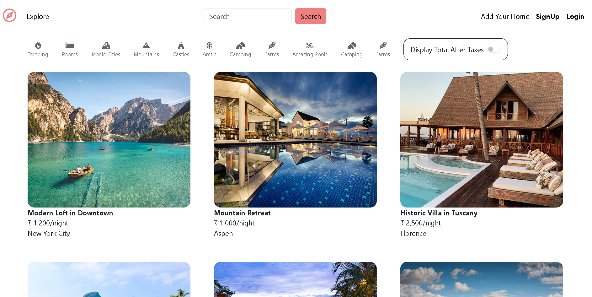

# 🌍 Airbnb Clone – Frontend UI Project

A sleek, responsive **Airbnb homepage clone** built using **HTML5, CSS3, and JavaScript**. This project replicates the front-end layout and design of Airbnb’s landing page, showcasing UI development and clean code structure.

---

## ✨ Features

- 🖼️ Pixel-perfect layout mimicking Airbnb's design
- 📱 Mobile-first responsive design
- 🧭 Navigation bar and location cards
- 🧹 Clean, semantic HTML structure
- 🎨 Custom CSS animations and hover effects

---
## 📸 UI Preview

### 🏠 Homepage


### 🛏️ Listing Page


---
## 🛠️ Tech Stack

| Technology | Description              |
|------------|--------------------------|
| HTML5      | Markup and page structure |
| CSS3       | Styling and layout design |
| JavaScript | Basic interactivity       |

---

## 📂 Folder Structure

```

Airbnb-Clone/
├── index.html         # Main HTML page
├── style.css          # Stylesheet
├── script.js          # JavaScript logic (optional)
└── assets/            # Images, icons, fonts
└── images/

````

---

## 🚀 How to Run Locally

1. **Clone the repository**
   ```bash
   git clone https://github.com/Pratik-dhangar/Airbnb-Clone.git
````

2. **Navigate to the project folder**

   ```bash
   cd Airbnb-Clone
   ```

3. **Open in browser**

   * Double-click `index.html`, or
   * Right-click > Open with Live Server (VS Code)

---

## 📸 Preview

> *(You can replace the placeholder image once you add screenshots)*


---

## 🔮 Future Enhancements

* [ ] Implement functional search bar
* [ ] Add filters and dynamic listings
* [ ] Convert to React.js SPA
* [ ] Add dark/light mode toggle

---

## 📬 Connect with Me

* 🔗 [LinkedIn](https://www.linkedin.com/in/pratik-dhangar)
* 💼 [GitHub](https://github.com/Pratik-dhangar)
* ✉️ [pratik.dhangar@example.com](mailto:pratik.dhangar@example.com) *(update email if needed)*

---

## ⭐ Support

If you find this project helpful or inspiring, please ⭐ the repo — it really motivates me!

---

## 📝 License

This project is licensed for personal and educational use only.

```

---

### ✅ How to use it:
1. Create a new file in the root of your GitHub repo named `README.md`.
2. Paste the content above.
3. Commit the changes.


```
